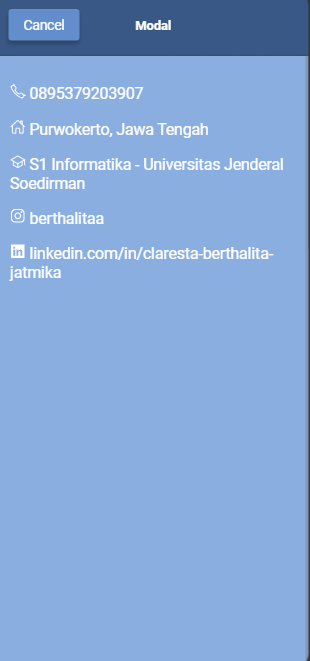

# Tugas 6
Nama : Claresta Berthalita Jatmika

NIM : H1D022050

Shift Baru: F

## Bagaimana cara untuk menambahkan Komponen di halaman Ionic? Jelaskan secara detail langkahnya.
Untuk menambahkan komponen baru ke halaman ionic terdapat beberapa langkah sebagai berikut : 
### 1. Buat Struktur Komponen pada file .HTML
Seperti pada file 'folder.page.html' saya menambahkan komponen berupa '<ion-card>' dan '<ion-modal>', dimana '<ion-modal>' di dalamnya terdapat '<ion-buttons>' dan '<ion-icon>'. 
'Komponen untuk Card' : menampilkan card untuk menyajikan informasi seperti nama, nim, dan shift.
'Komponen untuk Modal' : Menampilkan kontak detail atau informasi tambahan dengan menekan tombol 'selengkapnya' maka kontak detail akan ditampilkan

### 2. Atur CSS untuk menyesuaikan tampilan
Tambahkan CSS untuk mengatur tampilan sesuai yang diinginkan, seperti : 
Warna Latar Belakang: '--background'
Warna Font : '--color'
Memberikan ruang dalam elemen : 'padding'
Ukuran Font : 'font-size'
dll 

### 3. Kesimpulan
Komponen Card '<ion-card>' digunakan untuk menampilkan informasi pengguna dalam bentuk kartu yang rapi.
Komponen Modal '<ion-modal>' digunakan untuk menampilkan jendela pop-up berisi informasi kontak lebih lanjut, yang bisa dibuka dengan tombol "Selengkapnya".

### 4. Hasil SS

